<p align="center">
  
</p>

<h1 align="center">Wi-Fi Beacon Scanner</h1>

<p align="center">
  Wi-Fi сканер и диагностика для Windows 10/11: что вещают точки доступа, где слабое покрытие
  и почему ноутбук роумится или теряет связь.
</p>

<p align="center">
  <a href="https://github.com/salilov95/Wi-Fi-Beacon-Scanner/releases/latest"></a>
  <a href="https://github.com/salilov95/Wi-Fi-Beacon-Scanner/actions/workflows/ci.yml"></a>
  
  
  <a href="LICENSE"></a>
</p>

<p align="center">
  <a href="#возможности">Возможности</a> ·
  <a href="#установка">Установка</a> ·
  <a href="#документация">Документация</a>
</p>

<p align="center">
  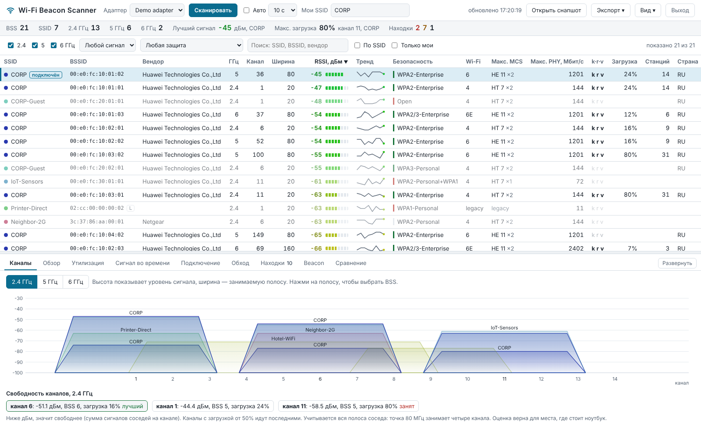
</p>

## Возможности

- **Таблица эфира** - все точки доступа 2.4, 5 и 6 ГГц: сигнал и тренд, канал и ширина, защита (WPA2/WPA3, PMF, AKM),
  поколение Wi-Fi, 802.11k/r/v, максимальный MCS и PHY-скорость, загрузка канала, клиенты, вендор.
- **Каналы** - спектр каждого диапазона с зоной DFS и подсказка, какой канал свободнее.
- **Журнал подключения ноутбука** - роуминги, обрывы с причиной от Windows, пинг-понг, залипание на слабой точке.
- **Обход по плану этажа** - карта покрытия по точкам замеров (site survey).
- **Сигнал во времени** - графики и тепловая карта RSSI с автосканом.
- **Загрузка каналов** - QBSS Load из beacon, от зелёного к красному.
- **Находки** - 29 проверок безопасности, роуминга, радио и гигиены сети с подсказкой, что проверить.
- **Расшифровка beacon** - все Information Elements выбранной точки.
- **Отчёты** - PDF, Excel, HTML, CSV, JSON: по всем сетям, только по своим или как в таблице.
- **Для раздачи на ноутбуки** - установщик с тихой установкой, семь тем, без внешних зависимостей.

### Журнал подключения ноутбука

Программа следит за собственным подключением раз в секунду: на какой точке ноутбук, с каким сигналом
и скоростью. Видно каждый роуминг (откуда, куда, RSSI до и после, сколько продержался), обрывы с причиной
от Windows, пинг-понг между двумя точками и залипание, когда ноутбук держится за слабую точку при наличии
сильной. MCS текущего подключения оценивается по скорости приёма и передачи.

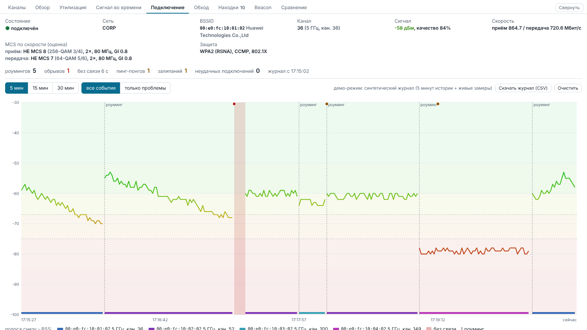

### Обход по плану этажа

Загрузите план этажа, ходите с ноутбуком и отмечайте, где стоите. В каждой точке программа делает скан
и строит карту покрытия: сигнал выбранной сети, сигнал подключения ноутбука или сколько точек доступа
слышно для роуминга. Вдали от замеров карта ничего не дорисовывает. Проект сохраняется в файл, карта - в PNG.

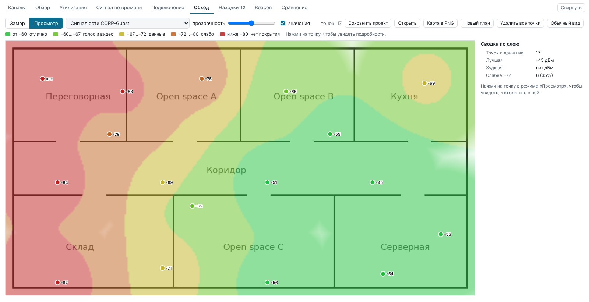

### Сигнал во времени

RSSI всех точек выбранной сети по сканам: линии окрашены по уровню, фон показывает зоны качества.
Есть тепловая карта «точка × скан», где сразу видно, какая точка пропадает.

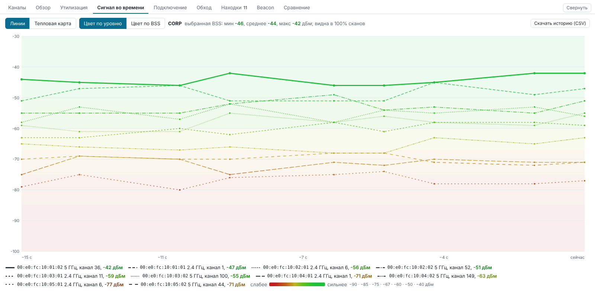

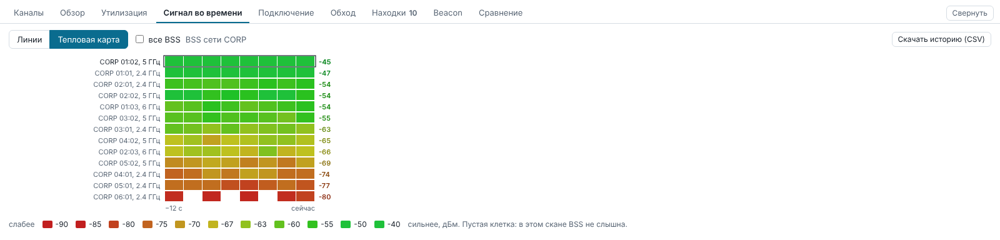

### Загрузка каналов

Сколько эфира занято на каждом канале по данным самих точек доступа (QBSS Load), число клиентов
и история по сканам. Каналы, где точки не сообщают загрузку, перечислены отдельно.

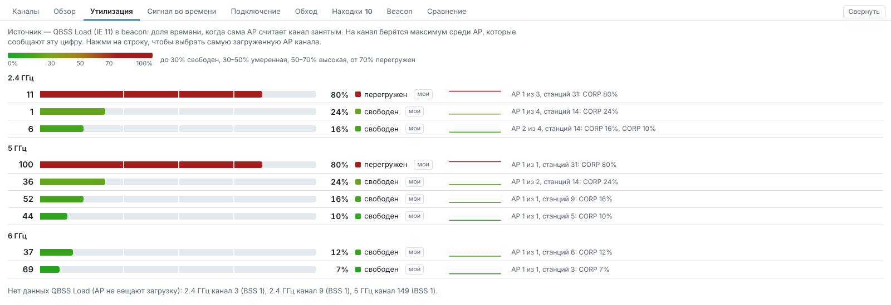

### Находки

Открытые и WEP-сети, TKIP, отсутствие PMF, 802.11k/r/v включены не на всех точках, разная защита
у одного SSID, перекрытие каналов в 2.4 ГГц, перегруженные каналы, слабый сигнал. Нажатие на находку
подсвечивает затронутые точки в таблице. Полный список - в [документации](docs/diagnostics.md).

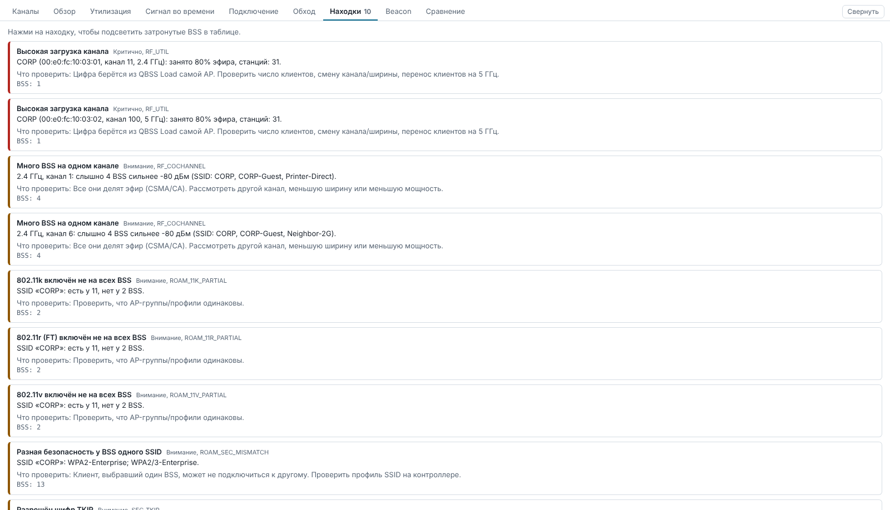

### Расшифровка beacon

Все Information Elements выбранной точки с расшифровкой и hex: RSN, HT/VHT/HE Capabilities и Operation,
наборы MCS, BSS Color, параметры 6 ГГц, vendor IE.

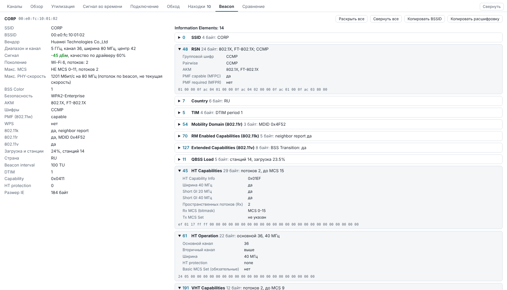

### Обзор эфира

Число точек по каналам, распределение по уровню сигнала, защите, поколениям Wi-Fi, ширине канала и вендорам.

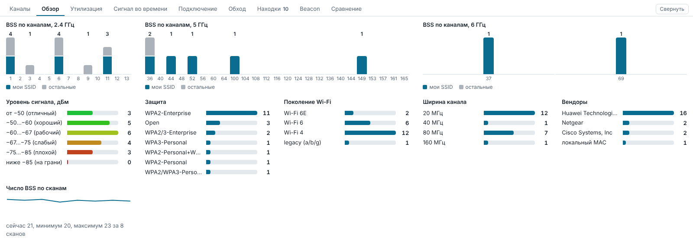

### Отчёты и темы

Отчёт в PDF и Excel (с цветовыми шкалами сигнала и загрузки), HTML, CSV, история замеров, журнал
подключения, снапшот JSON. Семь тем оформления, включая тёмную.

<table>
  <tr>
    <td width="50%" valign="top">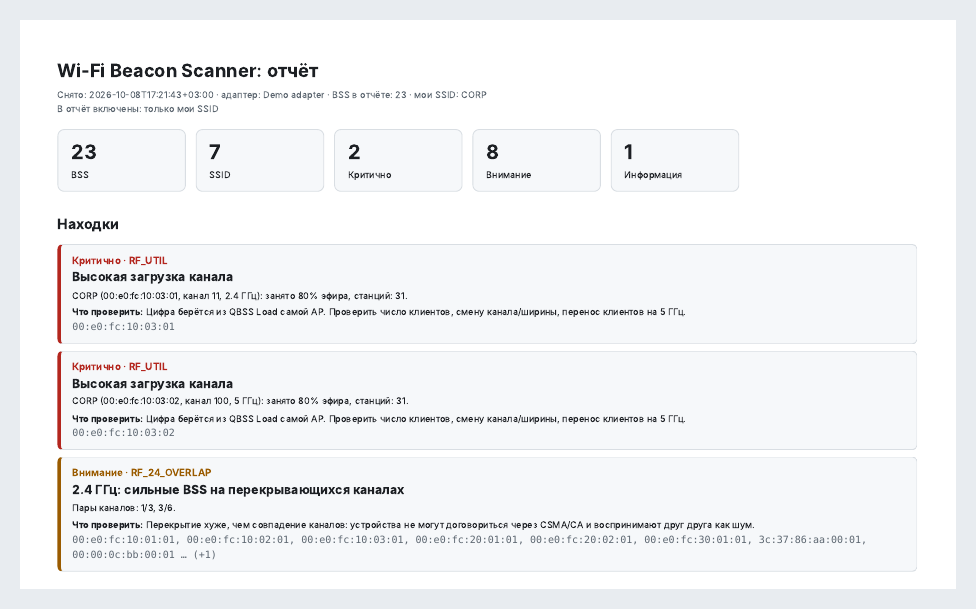</td>
    <td width="50%" valign="top">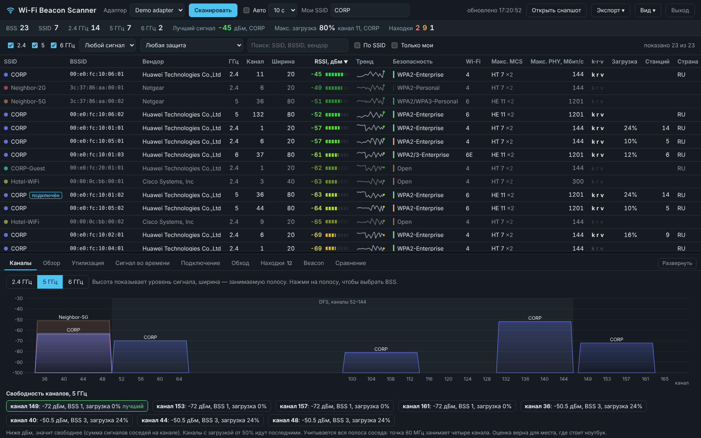</td>
  </tr>
</table>

## Установка

Скачайте со страницы [Releases](https://github.com/salilov95/Wi-Fi-Beacon-Scanner/releases/latest):

| Файл | Для чего |
|---|---|
| `WiFiBeaconScanner-Setup-<версия>.exe` | установщик: Program Files, ярлык в «Пуске», штатное удаление |
| `WiFiBeaconScanner.exe` | переносная версия одним файлом, без установки |

Тихая установка (SCCM, Intune, GPO, PDQ):

```
WiFiBeaconScanner-Setup-0.7.0.exe /VERYSILENT /SUPPRESSMSGBOXES /NORESTART /SP-
```

Файлы не подписаны сертификатом, поэтому при ручном запуске SmartScreen попросит подтверждение
(«Подробнее» → «Выполнить в любом случае»). Подробности - в [установке и раздаче](docs/deployment.md).

Из исходников (Python 3.8+, зависимостей нет):

```
python -m wifi_beacon_scanner gui            # сканировать
python -m wifi_beacon_scanner gui --demo     # посмотреть на демо-данных
```

## Документация

- [Установка и раздача на ноутбуки](docs/deployment.md) - тихая установка, где хранятся данные, ограничения
- [Диагностика](docs/diagnostics.md) - все проверки, шкала сигнала, загрузка канала, MCS и PHY-скорость
- [Журнал подключения](docs/connection-journal.md) - что фиксируется и как это устроено
- [Разработка, сборка и выпуск](docs/development.md) - запуск из исходников, CLI, тесты, сборка exe, релизы
- [История изменений](CHANGELOG.md)
- [Как вносить изменения](CONTRIBUTING.md)

## Лицензия

[MIT](LICENSE)
